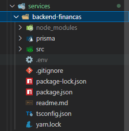
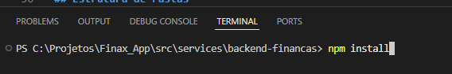

# Finax App

Bem-vindo ao **Finax App**! Este aplicativo foi desenvolvido para facilitar o controle financeiro pessoal, permitindo o gerenciamento de receitas, despesas e análise de saldo.

## Índice

- [Sobre o Projeto](#sobre-o-projeto)
- [Funcionalidades](#funcionalidades)
- [Pré-requisitos](#pré-requisitos)
- [Instalação](#instalação)
- [Como Usar](#como-usar)
- [Estrutura de Pastas](#estrutura-de-pastas)
- [Contribuição](#contribuição)
- [Licença](#licença)

---

## Sobre o Projeto

O **Finax App** é uma aplicação que auxilia no controle financeiro, permitindo cadastrar transações, visualizar histórico e acompanhar o saldo em tempo real.

## Funcionalidades

- Cadastro de receitas e despesas
- Visualização de histórico de transações
- Cálculo automático do saldo
- Interface intuitiva

## Pré-requisitos

- [Node.js](https://nodejs.org/) (versão recomendada: 16+)
- [npm](https://www.npmjs.com/) ou [yarn](https://yarnpkg.com/)

## Instalação

Clone o repositório e instale as dependências:

```bash
git clone https://github.com/AlessandroGFarias/Finax_App
cd Finax_App
npm install
```

## Como Usar

Vá até a pasta backend-financas, localizada na pasta src/services.



Inicie o arquivo no seu CMD e digite ```npm install```.



depois, Sincronize o banco abrindo seu cmd dentro da pasta do projeto e rodando:

```cmd
npx prisma migrate dev
```

- Após rodar o passo prisma migrate dev você pode olhar dentro da pasta prisma ele deve ter gerado um arquovo com nome `dev.db`


4) Agora pode rodar o projeto com ```yarn dev``` ou ```npm run dev```

* Sempre a api vai tentar rodar na porta ```3333```, exemplo: ```http://localhost:3333/login```


## Estrutura de Pastas

```
Finax_App/
├── public/             # Arquivos estáticos
├── src/
│   ├── components/     # Componentes reutilizáveis da interface
│   ├── pages/          # Páginas principais do app
│   ├── services/       # Serviços de API e lógica de dados
│   ├── App.js          # Componente principal
│   └── index.js        # Ponto de entrada da aplicação
├── package.json        # Dependências e scripts
└── README.md           # Documentação do projeto
```

## Contribuição

Contribuições são bem-vindas! Abra uma issue ou envie um pull request.

## Licença

Este projeto está sob a licença MIT.

---